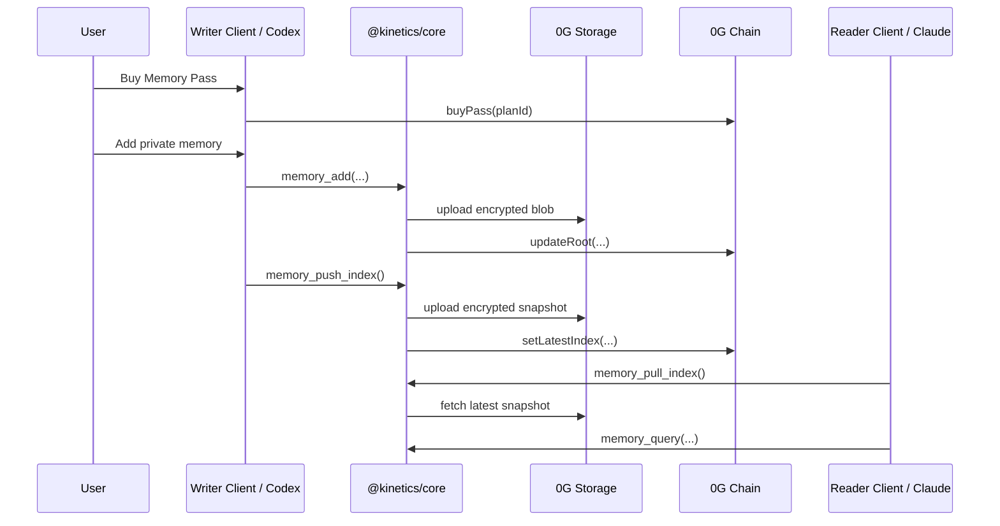
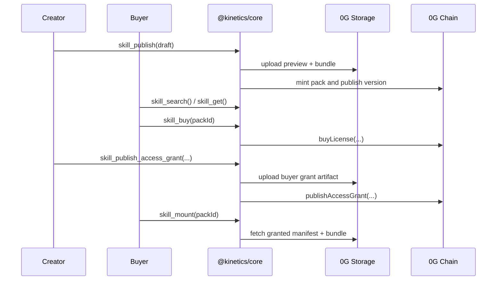

# Kinetics

[](https://www.typescriptlang.org/)
[](https://soliditylang.org/)
[](https://nextjs.org/)
[](https://modelcontextprotocol.io/)
[](https://0g.ai/)
[](#marketplace)

Kinetics is a TypeScript-first protocol and app stack for:

- portable private agent memory
- creator-owned skill packs
- licensed agent capabilities on 0G

It gives a user a vault that can be written by one client and recalled by another compatible MCP-connected agent, while also enabling a public marketplace for monetizable skill packs.

## Problem

AI agents today are fragmented.

- Private memory is usually trapped inside one app, one backend, or one session.
- Users cannot carry their memory layer across tools.
- Agent skills are hard to package, license, and distribute cleanly.
- Most systems optimize for app retention, not user ownership.

This creates two core gaps:

1. users do not own a portable memory identity
2. creators do not have a native marketplace for reusable agent capabilities

## Solution

Kinetics splits the system into two product surfaces:

- `Private Memory Pass`
  - a user buys a pass
  - derives a vault key
  - writes encrypted memory to 0G-backed storage
  - syncs the vault across compatible clients and MCP agents

- `Skill Pack Marketplace`
  - a creator publishes a pack and new versions
  - a buyer purchases a timed license
  - the creator issues an access grant
  - the buyer mounts the licensed pack into an agent workflow

## Why 0G

Kinetics uses 0G because the product needs all of these at once:

- verifiable data availability for memory and pack artifacts
- on-chain entitlements for passes and licenses
- user-portable state pointers instead of app-local storage only
- a design that works for both frontend clients and MCP agents

## Core Ideas

- encrypted private memory belongs to the user, not the app
- memory writes should be fast enough for real agent workflows
- sync should be explicit when cross-client sharing is needed
- creator assets should be publishable as reusable packs
- buyer access should be controlled by time-bounded licenses and grants

## Architecture

```mermaid
flowchart LR
  U[User Wallet] --> W[Web App]
  U --> M[MCP Client]

  W --> C[@kinetics/core]
  M --> S[@kinetics/mcp-server]
  S --> C

  C --> A[@kinetics/abi]
  C --> ZS[0G Storage]
  C --> ZC[0G Chain]

  ZC --> MP[MemoryPass]
  ZC --> MR[MemoryRegistry]
  ZC --> KP[KnowledgePackNFT]
  ZC --> PL[PackLicenseRegistry]
```

## Memory Flow



## Marketplace Flow



## 0G Integration

Kinetics uses 0G in four places.

### 1. Contract Layer

Deployed contracts define the ownership and entitlement model.

- `MemoryPass`
  - buy, renew, and upgrade vault access
  - stores the latest canonical index pointer
- `MemoryRegistry`
  - append-only Merkle root history for memory proofs
- `KnowledgePackNFT`
  - creator-owned pack identity and version metadata
- `PackLicenseRegistry`
  - timed buyer licenses and access grant publication

### 2. Storage Layer

0G Storage is used for:

- encrypted memory blobs
- encrypted vault snapshots
- preview manifests
- licensed pack bundles
- buyer access grants

### 3. Shared SDK Layer

`@kinetics/core` wraps the actual 0G interactions:

- upload / download
- encryption / decryption
- vault sync
- contract clients
- pack publish / mount logic

### 4. Client Layer

Both the web app and MCP server use the same shared business logic, which keeps behavior consistent across UI and agent flows.

## Monorepo Layout

```text
kinetics/
  apps/
    mcp-server/
    web/
  contracts/
    deployments/
    scripts/
    src/
  packages/
    abi/
    core/
  frontend.md
  plan.md
  README.md
```

## Workspaces

### `apps/web`

Next.js frontend with RainbowKit + wagmi.

Main routes:

- `/`
- `/buy-pass`
- `/memory`
- `/creator`
- `/marketplace`
- `/marketplace/[packId]`
- `/owned-packs`
- `/my-packs`

### `apps/mcp-server`

StdIO MCP server that exposes pass, memory, and marketplace tools to agent clients.

Implemented tool families:

- memory pass tools
- private memory tools
- marketplace tools

### `packages/core`

Shared reusable business logic:

- 0G storage upload/download
- encryption/decryption
- vault sync
- retrieval/ranking
- contract wrappers
- pack publish/mount logic
- license access logic

### `packages/abi`

Generated ABIs and deployment metadata from `contracts/`.

### `contracts`

Solidity contracts for passes, memory roots, packs, and timed licenses.

## Smart Contracts

### `MemoryPass.sol`

A non-transferable vault entitlement contract.

- one active pass per owner
- buy / renew / upgrade flows
- plan-based quota model
- latest index pointer for synced vault state

### `MemoryRegistry.sol`

The append-only proof layer for memory state.

- records Merkle roots over time
- supports proof verification flows

### `KnowledgePackNFT.sol`

The creator-side pack identity layer.

- pack minting
- version publishing
- sale term updates
- preview and bundle root tracking

### `PackLicenseRegistry.sol`

The buyer-side access layer.

- timed licenses
- renewals
- creator balances
- buyer access grants

## Product Model

### Private Memory Pass

After a pass is purchased, the user can repeatedly:

- add memory
- query memory
- summarize memory
- sync the vault across clients

The pass is not consumed per write. It is a vault entitlement governed by:

- expiry
- storage quota
- write quota

### Marketplace

Creators can:

- publish skill packs
- publish new versions
- update sale terms
- issue access grants to buyers

Buyers can:

- search public packs
- purchase timed licenses
- list owned packs
- mount and unmount packs

## Security Model

- memory content is encrypted before storage upload
- vault snapshots are encrypted before sync
- access control is enforced by on-chain pass and license state
- MCP clients can read only what the active vault key or buyer grant permits

## Retrieval Model

Kinetics supports:

- lexical relevance
- tag and namespace matching
- metadata-aware ranking
- proof-carrying query results where needed

The current retrieval path filters unrelated zero-overlap results so broad prompts do not dump arbitrary vault entries.

## Current Status

Implemented and verified:

- contracts
- ABI generation
- shared core package
- MCP server
- web app routes
- live 0G testnet deployment
- real-wallet memory flow
- live marketplace publish / buy / grant / mount flow

Current live deployment on `0g-testnet` from **May 14, 2026**:

- `MemoryPass`: `0xE2f5f82F138A6D1d94C3A8fFD6c1dC24D5384Fde`
- `MemoryRegistry`: `0x0Ca3d9da269F1a167365A59513a0428b1c2C9f00`
- `KnowledgePackNFT`: `0xF02c676411a3877770c9b15dfDb64141231D3a6F`
- `PackLicenseRegistry`: `0xFC34fB17db0726B70Df171BBC8CBac792Ae7FFbB`

Deployment record:

- [contracts/deployments/0g-testnet-1778771313865.json](contracts/deployments/0g-testnet-1778771313865.json)

## Getting Started

### Requirements

- Node.js 18+
- npm

### Install

```bash
npm install
```

### Build everything

```bash
npm run build
```

### Run tests

```bash
npm test
```

## Contract Workspace

Install contract dependencies:

```bash
cd contracts
npm install
```

Create `contracts/.env`:

```env
PRIVATE_KEY=0xYOUR_PRIVATE_KEY
RPC_URL=https://evmrpc-testnet.0g.ai
```

Build contracts:

```bash
cd contracts
npm run build
```

Run contract tests:

```bash
cd contracts
npm test
```

Deploy:

```bash
cd contracts
npm run deploy
```

## Web App

Start the frontend:

```bash
npm run build --workspace @kinetics/web
cd apps/web
npm run dev
```

The frontend uses:

- RainbowKit
- wagmi
- `@kinetics/core`
- `@kinetics/abi`

## MCP Server

Build the MCP server:

```bash
npm run build --workspace @kinetics/mcp-server
```

Run it locally:

```bash
cd apps/mcp-server
npm run start
```

## Example Demo Flow

### Demo A: Private Memory

Writer side:

1. `memory_pass_buy(plan_id)`
2. `memory_add(...)`
3. `memory_push_index()`

Reader side:

1. `memory_pass_status()`
2. `memory_pull_index()`
3. `memory_query(...)`

### Demo B: Marketplace

Creator side:

1. `skill_publish(draft_json)`
2. `skill_publish_access_grant(license_id[, version])`

Buyer side:

1. `skill_search(...)`
2. `skill_buy(pack_id)`
3. `skill_mount(pack_id)`

## Developer Notes

- the frontend should stay thin and consume shared logic from `@kinetics/core`
- the MCP server should remain a thin adapter over the same shared core package
- memory writes are optimized for MVP fast-path behavior
- snapshot sync is explicit rather than forced on every write

## Frontend Handoff

Frontend-specific route responsibilities and integration notes live in:

- [frontend.md](frontend.md)

## Scripts

Root scripts:

```bash
npm run build
npm run test
npm run build:mcp
npm run build:web
npm run test:mcp
npm run generate:abi
```

## Vision

Kinetics is aiming for a user-owned memory and capability layer for agents:

- one memory identity across clients
- one marketplace for creator-owned agent packs
- one shared stack for frontend, MCP, storage, and chain state

The long-term direction is simple:

**portable private memory + licensed public capabilities for AI agents.**
